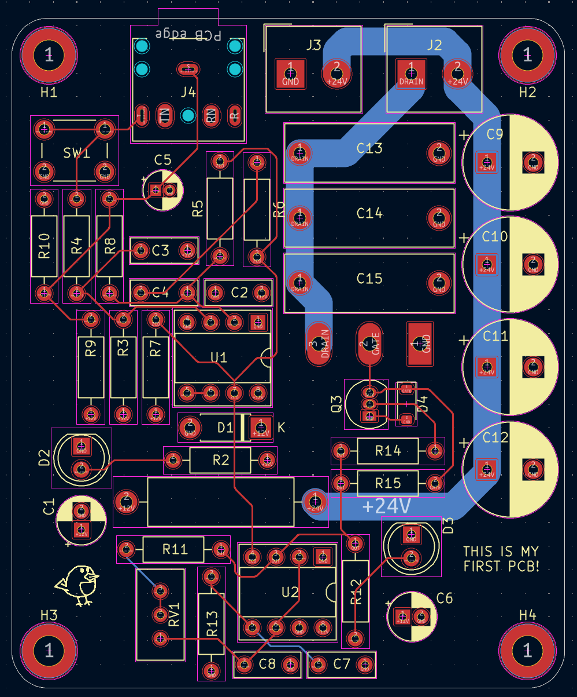

# Recreation of a Resonant Flyback Driver

A recreation of the Easy-Flyback driver by Franzoli Electronics: a resonant driver for CRT TV flyback transformers that produces high-voltage arcs, which can be audio-modulated to play music.
This repository contains a redrawn schematic and PCB layout based on his schematic published publicly on his page (https://franzolielectronics.com/easy-flyback-i/).

> All credit for the original circuit design goes to Franzoli!

&nbsp;

  

